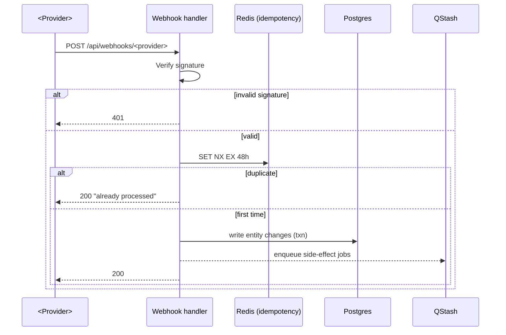

# Incoming Webhook: <Provider — Event>

## Source
- **Provider:** <Dodopayments | Razorpay | GitHub | ...>
- **Event types handled:** `subscription.created`, `subscription.cancelled`, ...
- **Configured at:** <provider dashboard URL>

## Endpoint
- **URL:** `https://api.<your-domain>/api/webhooks/<provider>`
- **Route file:** `apps/app/src/app/api/webhooks/<provider>/route.ts`
- **Method:** POST only (GET returns 405)
- **Public** — no auth header, signature-verified instead

## Signature verification

```typescript
const signature = req.headers.get('<provider>-signature');
const body = await req.text();
const expected = crypto
  .createHmac('sha256', process.env.<PROVIDER>_WEBHOOK_SECRET!)
  .update(body)
  .digest('hex');
if (signature !== expected) return new Response('Invalid signature', { status: 401 });
```

For providers like Dodopayments use the official SDK's `verifyWebhook` helper.

## Idempotency

```typescript
const eventId = parsedBody.id;       // provider's unique event ID
const dedupKey = `webhook:<provider>:${eventId}`;
const isFirst = await redis.set(dedupKey, '1', { nx: true, ex: 60 * 60 * 48 });
if (!isFirst) return new Response('Already processed', { status: 200 });
```

48h TTL covers all reasonable provider retry windows.

## Replay protection

- Reject events with `created_at` older than 5 minutes
- Reject events with `created_at` more than 1 minute in the future (clock skew)

## Event routing

```typescript
switch (parsedBody.type) {
  case 'subscription.created':
    await handleSubscriptionCreated(parsedBody);
    break;
  case 'subscription.cancelled':
    await handleSubscriptionCancelled(parsedBody);
    break;
  default:
    // Log unknown event but return 200 (provider won't retry)
    logger.warn('Unknown event type', { type: parsedBody.type });
}
return new Response('OK', { status: 200 });
```

## Per-event-type handlers

### `subscription.created`

**Trigger source:** customer completes checkout
**Affected entities:** `subscription`, `organization` (set `planId`, `currentPeriodEnd`)
**Side-effects:**
- Insert `subscription` row
- Update `organization.planId`
- Emit `subscription.activated` event
- Enqueue `send-activation-email` job (QStash)

### `subscription.cancelled`

**Trigger source:** customer or admin cancels
**Affected entities:** `subscription` (set `cancelAt`)
**Side-effects:**
- Update `subscription.cancelAt`
- Schedule downgrade EventBridge job at `cancelAt`
- Send confirmation email

(One subsection per event type.)

## Failure / DLQ

- Handler must return 2xx within 10s OR provider retries
- If handler throws, return 500 — provider's exponential backoff kicks in
- After 24h of failures, provider gives up — your `webhook_deliveries` table
  should flag it for manual review

## Manual retry endpoint

`POST /api/webhooks/<provider>/retry?eventId=<id>` (admin-only, requires
admin session) — re-fetches event from provider and re-runs handler.

## Telemetry

| Event | Props | When |
|---|---|---|
| `webhook.<provider>.received` | { type, eventId } | On every receipt |
| `webhook.<provider>.processed` | { type, eventId, durationMs } | On success |
| `webhook.<provider>.failed` | { type, eventId, errorCode } | On failure |
| `webhook.<provider>.duplicate` | { type, eventId } | On replay |

## Observability

- Sentry alert if failure rate > 5% over 5min window
- Dashboard: event count per type, success rate, avg latency

## Sequence diagram



## Related
- **Outgoing webhooks:** [webhooks-outgoing.md](../../shared/webhooks-outgoing.md)
- **Async architecture:** [async-architecture.md](../../shared/async-architecture.md)

## Changelog

| Version | Date | Changes |
|---------|------|---------|
| 1.0 | YYYY-MM-DD | Initial draft |
