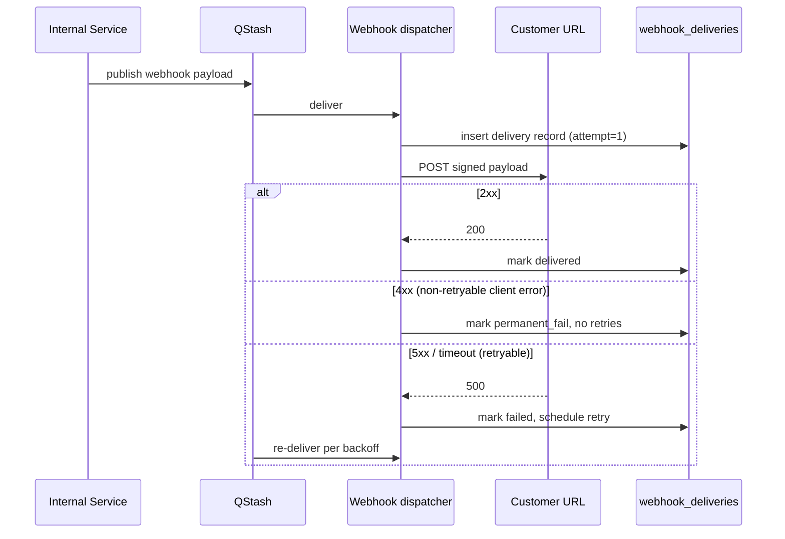

# Outgoing Webhooks

## Overview
Events emitted by our system to customer-supplied URLs. Each customer
configures one or more endpoints + signing secret in the dashboard.

## Event catalogue

| Event | Payload shape | Triggered by | Idempotency |
|---|---|---|---|
| `<entity>.created` | `{ id, ... }` | <action> | event.id |
| `<entity>.updated` | `{ id, ..., changedFields }` | <action> | event.id + version |
| `<entity>.deleted` | `{ id }` | <action> | event.id |

## Delivery

- **POST** to customer URL with JSON body
- **Headers**:
  - `Content-Type: application/json`
  - `User-Agent: <YourBrand>-Webhook/1.0`
  - `X-Webhook-Id: <ulid>` (delivery attempt ID)
  - `X-Webhook-Event: <event>` (e.g. `subscription.created`)
  - `X-Webhook-Signature: t=<unix>,v1=<hmac>` (similar to Stripe scheme)
  - `X-Webhook-Timestamp: <unix>`
  - `X-Webhook-Delivery: <attempt>` (1, 2, 3, ...)

## Signature scheme

```
signed_string = `${timestamp}.${body}`
hmac = HMAC-SHA256(customer_secret, signed_string)
header = `t=${timestamp},v1=${hex(hmac)}`
```

Customers verify by:
1. Splitting header on `,` and `=`
2. Reject if `t` is > 5 min old
3. Compute HMAC and constant-time compare

## Retry policy

- Initial: immediate
- Retry 1: +30s
- Retry 2: +5min
- Retry 3: +30min
- Retry 4: +2h
- Retry 5: +12h
- Retry 6: +24h
- Give up after 7 attempts
- DLQ surfaces in customer dashboard for manual replay

## Delivery log

Every attempt persisted in `webhook_deliveries`:
- `id`, `customer_endpoint_id`, `event`, `body`, `status`, `attempt`,
  `response_code`, `response_body_truncated`, `delivered_at`, `next_retry_at`

Customer-visible in dashboard with manual "Replay" button.

## Endpoint configuration

Customer adds endpoints in Settings → Webhooks:
- URL (https-only)
- Events to subscribe to (multi-select)
- Signing secret (auto-generated, copy-once shown)
- Active toggle
- Per-endpoint stats: success rate, last delivery, last failure

## Secret rotation

- Generate new secret in dashboard → both old and new accepted for 24h
- After 24h, only new accepted
- Customer notified by email on rotation

## Size limits

- Max payload: 256 KB
- Larger events: include only an ID + URL to fetch full payload via REST

## URL allowlist (for security)

- Customer URLs must be HTTPS
- Reject `localhost`, RFC1918 ranges, link-local — prevent SSRF
- Resolve DNS server-side and pin to public IPs only

## Per-event TTL

Old events not retried indefinitely:
- After 24h since `event.created_at`, mark as `expired`
- Manual replay still works from dashboard

## Telemetry

| Event | Props | When |
|---|---|---|
| `webhook.dispatched` | { event, endpointId, attempt } | On attempt |
| `webhook.delivered` | { event, endpointId, attempt, durationMs } | On success |
| `webhook.failed` | { event, endpointId, attempt, statusCode } | On failure |
| `webhook.exhausted` | { event, endpointId } | After 7th failure |

## Sequence diagram



## Related
- **Incoming webhooks:** [webhooks-incoming.md](./webhooks-incoming.md)
- **Async architecture:** [async-architecture.md](./async-architecture.md)

## Changelog

| Version | Date | Changes |
|---------|------|---------|
| 1.0 | YYYY-MM-DD | Initial draft |
