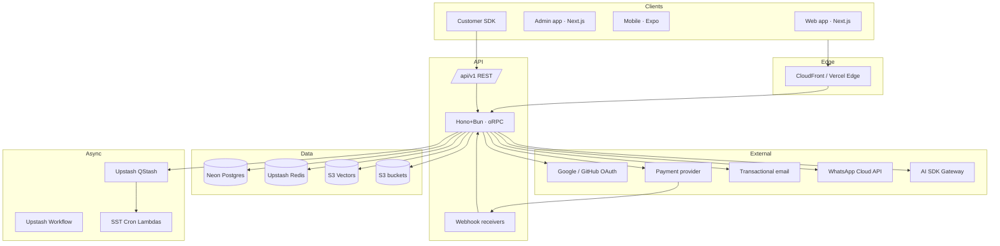
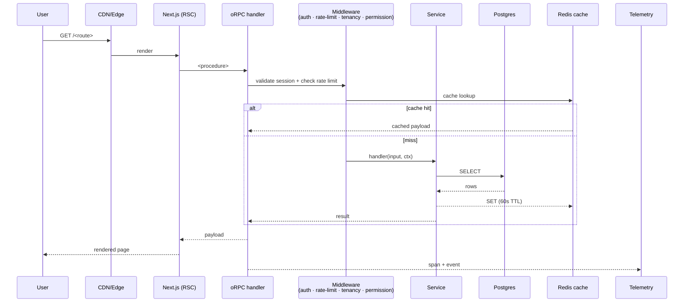
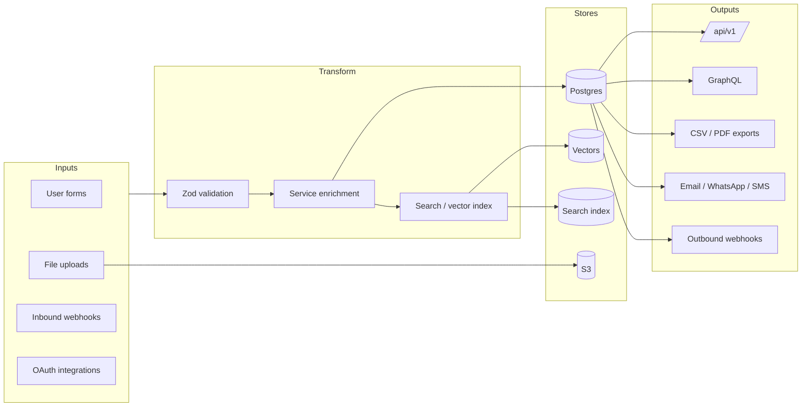
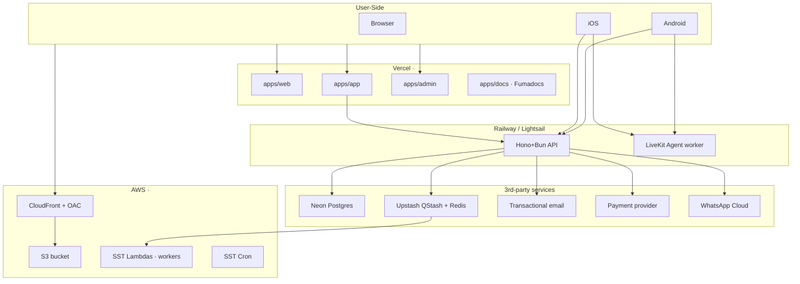
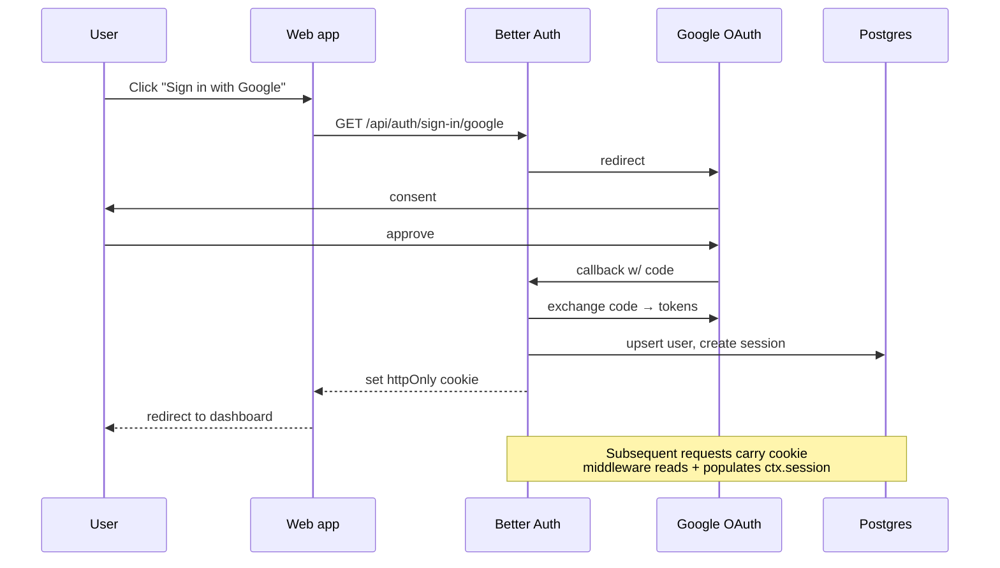
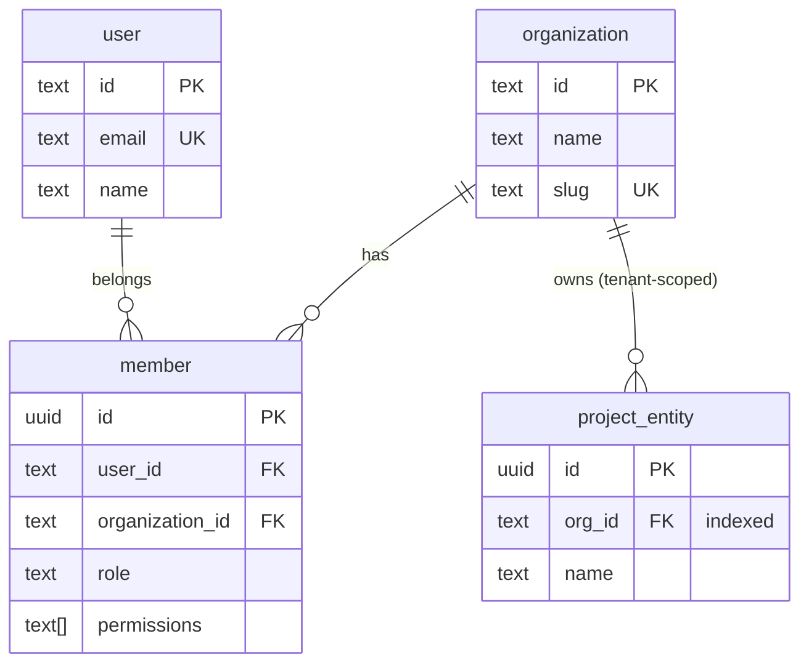
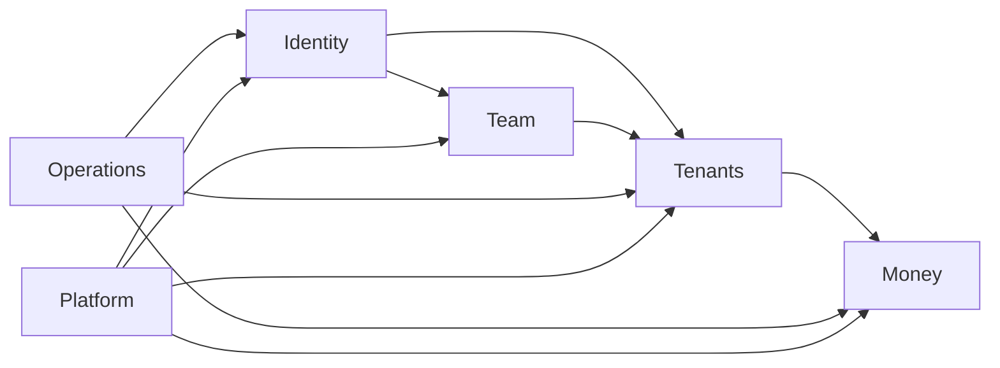
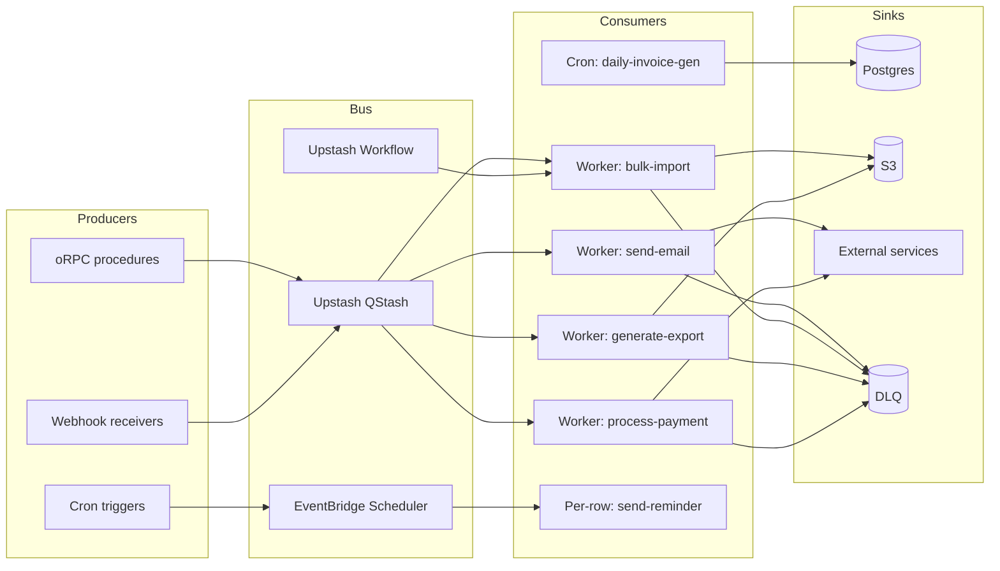
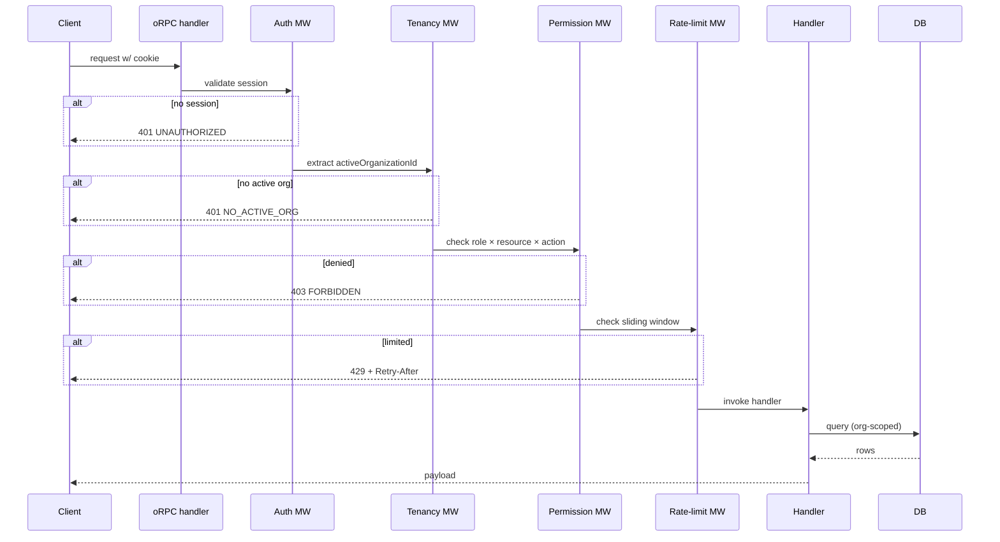

# Architecture Overview

The 9 mandatory project-wide diagrams. Skip none.

## 1. System architecture

## 2. Request lifecycle

## 3. Data flow

## 4. Deployment topology

Regions and region-specific vendor bundles (e.g. an India bundle:
`ap-south-1` + WhatsApp Cloud + a local payment provider) are one named
option — pick per project, not a silent default.

## 5. Auth flow

## 6. Tenancy model

## 7. Module map

(Customise per project — show the actual module list and dependency arrows.)

## 8. Async architecture

## 9. Permission flow

## Related
- **Module diagrams:** per-module in `modules/<m>/module.md`
- **NFR:** [nfr.md](./shared/nfr.md)
- **Async architecture detail:** [async-architecture.md](./shared/async-architecture.md)

## Changelog

| Version | Date | Changes |
|---------|------|---------|
| 1.0 | YYYY-MM-DD | Initial draft |
