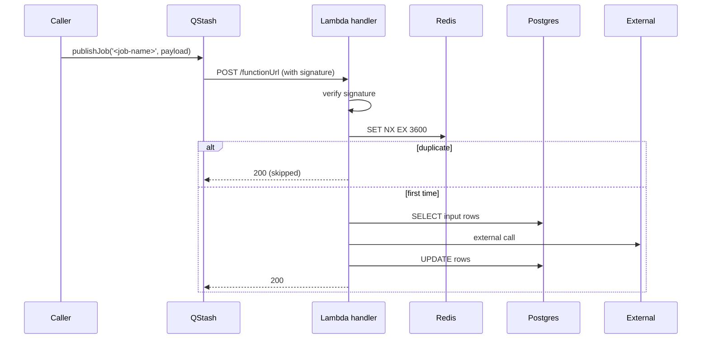

# Async Job: <Job Name>

## Purpose
<What this job does in one sentence.>

## Trigger

| Type | Detail |
|---|---|
| Fire-and-forget | QStash `publishJob('<job-name>', payload)` from `<caller>` |
| Scheduled (cron) | `0 6 * * *` (06:00 UTC daily) via SST Cron |
| Per-row schedule | EventBridge Scheduler created per row at `<entity>.<field>` |
| S3 event | `s3:ObjectCreated:*` on `<bucket>/<prefix>` |
| Webhook | `/api/webhooks/<provider>` (see incoming-webhook doc) |
| Hasura cron trigger | `<trigger-name>` POSTing to `/api/internal/<endpoint>` |

(Pick one. Keep the others as N/A.)

## Handler

- **File:** `packages/workers/src/handlers/<job-name>.ts`
- **Function name:** `<jobNameHandler>`
- **Deployed as:** SST Lambda (Node 22, 1 GB, 5 min timeout)
- **Function URL:** yes (called from QStash) / no (event source mapping)

## Execution flow

```mermaid
flowchart TB
  Trig[<trigger>] --> Verify{verify signature?}
  Verify -- invalid --> Reject[401]
  Verify -- valid --> Idemp{redis.set NX EX 1h<br/>key = job:<job-name>:<input-hash>}
  Idemp -- seen --> Skip[200 — already processed]
  Idemp -- new --> Fetch[fetch input]
  Fetch --> Process[business logic]
  Process -- success --> Persist[write results]
  Persist --> Telemetry[emit success event]
  Telemetry --> Done[200]
  Process -- retryable --> Retry[throw — QStash retries]
  Process -- permanent --> DLQ[send to DLQ + Sentry]
```



## Input payload

```typescript
type Payload = {
  jobId: string;                          // UUIDv7
  triggeredBy: 'user' | 'cron' | 'webhook';
  actorId?: string;
  orgId: string;
  entityId: string;
  metadata?: Record<string, unknown>;
};
```

## Output

- Success: 200 + `{ ok: true }`
- Idempotent skip: 200 + `{ ok: true, skipped: true }`
- Retryable: 5xx (or throw — QStash interprets)
- Permanent: 200 + `{ ok: false, permanent: true }` (so QStash doesn't retry)

## Side-effects

- DB writes: `<table>` rows updated
- Events emitted: `<event-name>` (consumers: <module>, <module>)
- External calls: `<service>` (with retry policy)
- Files written: `<bucket>/<path>`

## Idempotency

- Key: `job:<job-name>:<input-hash>`
- Storage: Upstash Redis
- TTL: 1 hour (or longer if the job is destructive)
- Strategy: `SET key value NX EX 3600` — first to set wins, others skip

## Retry policy

| Attempt | Delay | Notes |
|---|---|---|
| 1 | immediate | First attempt |
| 2 | +30s | |
| 3 | +5min | |
| 4 | +30min | |
| 5 | +2h | |
| 6 | +12h | |
| Give up | — | Send to DLQ + Sentry alert |

Implementation: QStash's built-in retry policy via `Upstash-Retries` header.

## DLQ

- Failed messages land in `<job-name>-dlq` queue
- Sentry alert fires on DLQ depth > 0
- Admin tool at `/admin/dlq` for manual replay

## Cold-start mitigation (if latency-sensitive)

- Provisioned concurrency: 2 (if p95 latency matters)
- Otherwise: accept cold-start tax

## Runtime budget

- Max runtime: 5 min (Lambda timeout)
- Target p95: 30s
- Alert if p95 > 2 min

## Secrets

- `<SECRET_NAME>`: <purpose>, sourced from `<location>` (SST Secret / env var)

## Observability

| Metric / event | Source |
|---|---|
| `job.<job-name>.invoked` | Handler start |
| `job.<job-name>.succeeded` | Handler success |
| `job.<job-name>.failed` | Handler failure |
| `job.<job-name>.duration_ms` | Histogram |
| `job.<job-name>.idempotent_skip` | Counter |
| `job.<job-name>.dlq_depth` | CloudWatch metric on DLQ |

Alerts:
- DLQ depth > 0 → Slack #alerts
- Failure rate > 5% / 5min → Sentry + Slack
- p95 latency > 2 min → Slack

## Sequence (concrete)



## Recovery / manual replay

- Admin endpoint: `POST /admin/jobs/<job-name>/replay?jobId=<id>`
- Re-fetches payload from `job_history`, re-runs handler
- Logs to `audit_log` with `replayedBy`

## Related
- **Async architecture overview:** [async-architecture.md](../../shared/async-architecture.md)
- **Module:** [module.md](../module.md)
- **Triggers it (caller side):** [feature-<name>](../features/feature-<name>.md)

## Changelog

| Version | Date | Changes |
|---------|------|---------|
| 1.0 | YYYY-MM-DD | Initial draft |
