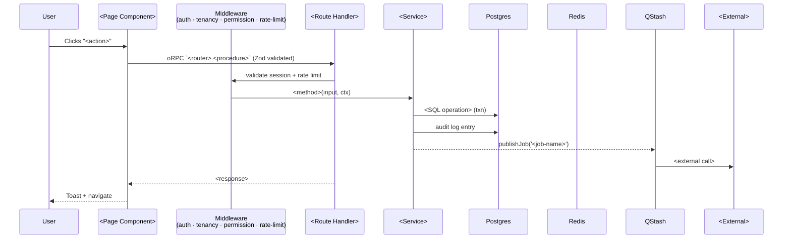

# Feature: <Name>

## Summary
<One or two sentences describing what this feature does.>

## Problem Statement
<What problem does this solve? Who faces this problem?>

## User Stories

- As an **<Role>**, I want to <action> so that <benefit>
- As a **<Role>**, I want to <action> so that <benefit>

## Scope

### In Scope
- <What this feature covers>

### Out of Scope
- <What this feature explicitly does NOT cover>

## Requirements

### Must Have
1. <Essential>

### Should Have
1. <Important but not critical>

### Nice to Have
1. <Optional>

## End-to-End Wiring

### Sequence diagram

### File-level paths
- UI: `apps/app/src/app/(<group>)/<route>/page.tsx`
- Form/component: `apps/app/src/components/<module>/<component>.tsx`
- API route: `apps/app/src/app/api/rpc/[[...rest]]/route.ts` → `<router>.<procedure>`
- Procedure: `packages/api/src/routers/<router>.ts`
- Service: `packages/api/src/services/<service>.ts`
- DB schema: `packages/db/src/schema/<entity>.ts`
- Job handler: `packages/workers/src/handlers/<job-name>.ts`
- Email template: `packages/email/src/templates/<template>.tsx`
- Event emitted: `<entity>.<verb>` → consumed by [<module>](../../<consumer-module>/module.md)

### Validation
- Zod schema: `<name>Schema` in `packages/api/src/schemas/<entity>.ts`
- DB constraints: `<column> CHECK (...)`, `<column> UNIQUE`
- Business rules: <rule>

### Idempotency
- Client-supplied `X-Idempotency-Key` (UUIDv7)
- Server: Redis `SET NX EX 600` keyed by `<id>:<input-hash>`

### Caching
- Read: 60s TTL keyed by `<entity>:<id>` invalidated on update
- Stampede protection: `@upstash/redis` `getEx` + lock

## User Experience

### Entry Points
- <How users reach this feature>

### Key Screens
1. **<Screen>** — <Purpose>
2. **<Screen>** — <Purpose>

### User Flow
1. User does X
2. System shows Y
3. User confirms Z
4. System completes action

## Business Rules
- <Rule 1>
- <Rule 2>

## State Machine
(Only if this feature has stateful behaviour. Otherwise N/A.)
See [state-machines/status-<entity>.md](../state-machines/status-<entity>.md)

## Edge Cases

Walk through every category in `references/06-edge-case-guide.md` and either
fill or mark `N/A — <reason>`. The categories are mandatory; the answers
are project-specific.

### Empty States
| Scenario | Behavior |
|----------|----------|
| No items yet | <copy + CTA> |
| Search returns no results | <copy + suggestions> |

### Boundary Conditions
| Scenario | Behavior |
|----------|----------|
| Max value | <action> |
| Min value | <validation> |
| Special characters | <sanitize / reject> |

### Permission & Access
| Scenario | Behavior |
|----------|----------|
| User lacks permission | 403 with <copy> |
| Role changes mid-session | <action> |
| Item archived | <copy> |

### Concurrent Actions
| Scenario | Behavior |
|----------|----------|
| Two users edit | <last-write / OT / lock / conflict UI> |
| Item deleted while viewing | <copy> |
| Stale data submitted | <action> |

### Network & Errors
| Scenario | Behavior |
|----------|----------|
| Offline | <queue / cached> |
| Timeout | <retry policy> |
| 5xx | <copy + retry> |
| 4xx | <field highlight> |

### Time-based
| Scenario | Behavior |
|----------|----------|
| Token expiry | <action> |
| Timezone | <UTC storage, locale display> |
| DST | <action> |

### Rate Limiting
| Scenario | Behavior |
|----------|----------|
| Limit exceeded | 429 + `Retry-After` header |

### Idempotency
| Scenario | Behavior |
|----------|----------|
| Retry within 10min window | Returns original response |
| Retry after window | New attempt |

### External dependencies
| Scenario | Behavior |
|----------|----------|
| <External> down | <degrade / cache / fail> |

(Continue through all 24 categories — mark `N/A` where it doesn't apply.)

## Success Criteria
- [ ] <Measurable outcome>

## Telemetry events
| Event | Props | When fired |
|---|---|---|
| `<entity>.<verb>` | { entityId, actorId, orgId } | On success |
| `<entity>.<verb>.failed` | { entityId, actorId, errorCode } | On failure |

## Accessibility checklist
- [ ] Keyboard navigation works end-to-end
- [ ] Focus management on modal open/close
- [ ] ARIA labels on icon-only buttons
- [ ] Color contrast WCAG AA
- [ ] Screen-reader announces dynamic content
- [ ] Respects `prefers-reduced-motion`

## Dependencies
- [feature-<name>](./feature-<name>.md) — <why>

## Related Documentation
- **Module:** [module.md](../module.md)
- **API:** [api-<name>](../api/api-<name>.md)
- **Schema:** [schema-<name>](../schema/schema-<name>.md)
- **Workflow:** [workflow-<name>-<action>](../workflows/workflow-<name>-<action>.md)
- **Observability:** [observability.md](../observability.md)
- **Compliance:** [compliance.md](../compliance.md)
- **Test plan:** [test-plan.md](../test-plan.md)

## Open Questions
- [ ] <unresolved>

## Changelog

| Version | Date | Changes |
|---------|------|---------|
| 1.0 | YYYY-MM-DD | Initial draft |
