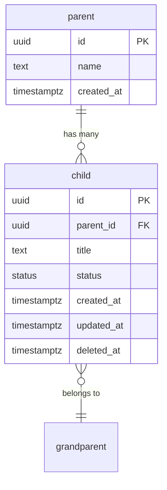

# Database Schema: <Feature> (Drizzle)

## Overview
<Brief description.>

## ERD



## Tables

### `<table_name>`

<Description.>

#### Columns

| Column | Type | Nullable | Default | Description |
|--------|------|----------|---------|-------------|
| `id` | `uuid` | No | `gen_random_uuid()` | Primary key |
| `org_id` | `text` | No | — | FK → organization.id (Better Auth text IDs) |
| `name` | `varchar(100)` | No | — | Display name |
| `slug` | `varchar(120)` | No | — | URL slug |
| `description` | `text` | Yes | `null` | Long description |
| `status` | `<enum>` | No | `'draft'` | State |
| `metadata` | `jsonb` | Yes | `null` | Flexible config |
| `created_at` | `timestamptz` | No | `now()` | Creation |
| `updated_at` | `timestamptz` | No | `now()` | Last update (trigger) |
| `deleted_at` | `timestamptz` | Yes | `null` | Soft delete |
| `created_by` | `text` | No | — | FK → user.id |

#### Foreign keys

| Column | References | On Delete |
|---|---|---|
| `org_id` | `organization.id` | CASCADE |
| `created_by` | `user.id` | RESTRICT |

#### Indexes

| Name | Columns | Type | Purpose |
|---|---|---|---|
| `<table>_org_status_idx` | (org_id, status) | btree | List page filter |
| `<table>_slug_unique` | (org_id, slug) | unique | Slug uniqueness per org |
| `<table>_created_at_idx` | created_at desc | btree | Sort default |
| `<table>_active_idx` | (org_id) where deleted_at is null | partial | Live records only |

#### Constraints

| Name | Type | Columns | Condition |
|---|---|---|---|
| `<table>_amount_positive` | CHECK | amount | `amount >= 0` |
| `<table>_phone_format` | CHECK | phone | `phone ~ '^\+\d{10,15}$'` |

#### PII fields

| Column | PII Category | Retention | Deletion Handler |
|---|---|---|---|
| `name` | Personal | While org active + 90d | Cascade on org delete |
| `phone` | Personal — direct identifier | 7y for financial reasons | Soft delete + redact after 30d |

(See `compliance.md`.)

## Enums

```sql
CREATE TYPE status AS ENUM ('draft', 'active', 'archived');
```

## Drizzle schema

```typescript
import {
  pgTable, uuid, varchar, text, timestamp, jsonb, pgEnum,
  index, uniqueIndex,
} from 'drizzle-orm/pg-core';
import { sql } from 'drizzle-orm';
import { organization, user } from './auth';

export const statusEnum = pgEnum('status', ['draft', 'active', 'archived']);

export const <table> = pgTable('<table>', {
  id: uuid('id').defaultRandom().primaryKey(),
  orgId: text('org_id').notNull().references(() => organization.id, { onDelete: 'cascade' }),
  name: varchar('name', { length: 100 }).notNull(),
  slug: varchar('slug', { length: 120 }).notNull(),
  description: text('description'),
  status: statusEnum('status').notNull().default('draft'),
  metadata: jsonb('metadata'),
  createdAt: timestamp('created_at', { withTimezone: true }).notNull().defaultNow(),
  updatedAt: timestamp('updated_at', { withTimezone: true }).notNull().defaultNow(),
  deletedAt: timestamp('deleted_at', { withTimezone: true }),
  createdBy: text('created_by').notNull().references(() => user.id, { onDelete: 'restrict' }),
}, (t) => ({
  orgStatusIdx: index('<table>_org_status_idx').on(t.orgId, t.status),
  slugUnique: uniqueIndex('<table>_slug_unique').on(t.orgId, t.slug),
  createdAtIdx: index('<table>_created_at_idx').on(sql`${t.createdAt} DESC`),
  activeIdx: index('<table>_active_idx').on(t.orgId).where(sql`${t.deletedAt} IS NULL`),
}));

export const <table>Relations = relations(<table>, ({ one, many }) => ({
  organization: one(organization, { fields: [<table>.orgId], references: [organization.id] }),
  creator: one(user, { fields: [<table>.createdBy], references: [user.id] }),
}));

export type <Entity> = typeof <table>.$inferSelect;
export type New<Entity> = typeof <table>.$inferInsert;
```

## Common query patterns

```typescript
// List for org (active only)
const items = await db.query.<table>.findMany({
  where: and(
    eq(<table>.orgId, orgId),
    isNull(<table>.deletedAt),
  ),
  orderBy: desc(<table>.createdAt),
  limit: 20,
});

// Soft delete
await db.update(<table>)
  .set({ deletedAt: new Date() })
  .where(eq(<table>.id, id));

// Slug check (case-insensitive)
const exists = await db.query.<table>.findFirst({
  where: and(
    eq(<table>.orgId, orgId),
    sql`lower(${<table>.slug}) = lower(${slug})`,
  ),
});
```

## Updated-at trigger

```sql
CREATE TRIGGER set_<table>_updated_at
  BEFORE UPDATE ON <table>
  FOR EACH ROW
  EXECUTE FUNCTION update_updated_at_column();
```

(Assumes `update_updated_at_column()` exists from baseline migration.)

## Migration

```bash
pnpm drizzle-kit generate --name=<descriptive-name>
pnpm drizzle-kit migrate
```

Never `db:push` in this project.

## Audit table (if needed)

If this entity needs an audit trail beyond `created_at` / `updated_at` /
`deleted_at`, add `<table>_history`:

```typescript
export const <table>History = pgTable('<table>_history', {
  id: uuid('id').defaultRandom().primaryKey(),
  <table>Id: uuid('<table>_id').notNull().references(() => <table>.id, { onDelete: 'cascade' }),
  actorId: text('actor_id').notNull(),
  action: varchar('action', { length: 50 }).notNull(),    // 'created', 'updated', 'archived'
  details: jsonb('details'),                               // before/after diff
  createdAt: timestamp('created_at', { withTimezone: true }).notNull().defaultNow(),
});
```

## Related
- **Module:** [module.md](../module.md)
- **API:** [api-<name>](../api/api-<name>.md)
- **Feature:** [feature-<name>](../features/feature-<name>.md)

## Changelog

| Version | Date | Changes |
|---------|------|---------|
| 1.0 | YYYY-MM-DD | Initial draft |
