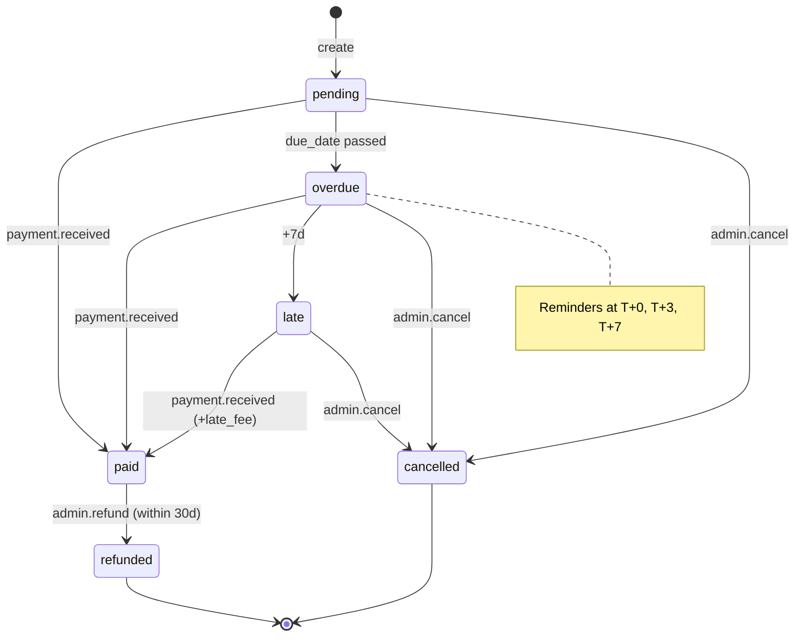

# State Machine: <Entity>.<status_field>

## Overview
<What this state machine represents — e.g. invoice lifecycle, blog
post publication flow, order fulfilment.>

## States

| State | Description | Terminal? |
|---|---|---|
| `pending` | <description> | No |
| `paid` | <description> | No |
| `overdue` | <description> | No |
| `late` | <description> | No |
| `cancelled` | <description> | Yes |
| `refunded` | <description> | Yes |

## Transitions

| From | To | Trigger | Guard | Side-effects |
|---|---|---|---|---|
| `pending` | `paid` | `payment.received` | amount >= total | Update `paid_at`; emit `invoice.paid` |
| `pending` | `overdue` | (scheduled, due_date passed) | none | Emit `invoice.overdue`; send reminder |
| `overdue` | `paid` | `payment.received` | amount >= total + late_fee | Same as above + clear late_fee status |
| `overdue` | `late` | (scheduled, +7d after due) | none | Apply late fee; emit `invoice.late` |
| `late` | `paid` | `payment.received` | amount >= total + late_fee | Same |
| any non-terminal | `cancelled` | `admin.cancel` | actor.role = admin | Emit `invoice.cancelled`; reverse charges |
| `paid` | `refunded` | `admin.refund` | actor.role = admin, within 30d | Emit `invoice.refunded`; trigger payout |

## Diagram



## Invalid transitions

Always block (return `INVALID_STATE_TRANSITION`):

- `cancelled` → anything
- `refunded` → anything
- `paid` → `pending` / `overdue` / `late` (use refund flow instead)

## Side-effects per transition (detailed)

### `pending → paid`

- Update `<entity>` row:
  - `status = 'paid'`
  - `paid_at = now()`
  - `paid_amount = <amount>`
  - `payment_method = <method>`
- Insert `<entity>_history`:
  - `action = 'paid'`, `actor = <user>`, `details = { amount, method, ref }`
- Emit `<entity>.paid` event (consumers: notifications, reports)
- Enqueue `send-receipt-email` job

### `pending → overdue`

- Update `<entity>` row:
  - `status = 'overdue'`
  - `overdue_since = now()`
- Insert history
- Emit `<entity>.overdue`
- Enqueue reminder schedule (EventBridge per-row)

(Repeat per transition.)

## Guards (implementation in service layer)

```typescript
// packages/api/src/services/<entity>-state.ts
export function canTransition(from: Status, to: Status, ctx: TransitionCtx): boolean {
  const allowed: Record<Status, Status[]> = {
    pending:   ['paid', 'overdue', 'cancelled'],
    overdue:   ['paid', 'late', 'cancelled'],
    late:      ['paid', 'cancelled'],
    paid:      ['refunded'],
    cancelled: [],
    refunded:  [],
  };
  if (!allowed[from].includes(to)) return false;
  return guards[`${from}->${to}`]?.(ctx) ?? true;
}

const guards: Record<string, (ctx: TransitionCtx) => boolean> = {
  'pending->paid': (ctx) => ctx.amount >= ctx.entity.total,
  'overdue->paid': (ctx) => ctx.amount >= ctx.entity.total + ctx.entity.lateFee,
  'paid->refunded': (ctx) => ctx.actor.role === 'admin' && daysSince(ctx.entity.paidAt) <= 30,
};
```

## Race conditions

- **Concurrent state change attempts**: use optimistic locking via
  `WHERE status = <current>` in UPDATE; if 0 rows affected, retry from
  fresh read or return `CONFLICT`
- **Scheduled transition vs manual transition**: scheduled job checks
  current status before transitioning (idempotent)

## Telemetry per transition

```typescript
posthog.capture('<entity>.transition', {
  entityId: id,
  from: prevStatus,
  to: newStatus,
  actorId: ctx.actor.id,
  trigger: ctx.trigger,            // 'manual' | 'scheduled' | 'webhook'
  durationMs: elapsed,
});
```

## Recovery paths (manual ops)

If state gets stuck (rare):
- Admin tool at `/admin/<entity>/[id]/force-transition` (admin-only)
- Forces a transition, requires reason
- Logs to audit with `forced: true` flag

## Related
- **Feature:** [feature-<name>](../features/feature-<name>.md)
- **Workflow:** [workflow-<name>](../workflows/workflow-<name>.md)
- **Schema:** [schema-<name>](../schema/schema-<name>.md)

## Changelog

| Version | Date | Changes |
|---------|------|---------|
| 1.0 | YYYY-MM-DD | Initial draft |
