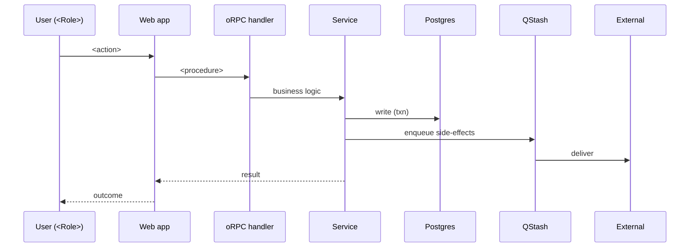

# Workflow: <Feature> — <Action>

## Summary
<One sentence describing what this workflow accomplishes.>

## Trigger
<What initiates this workflow? User click? Webhook? Scheduled job?>

## Actors

- **Primary:** <User Role>
- **System:** <Application Name>
- **External:** <Payment / Email / SMS provider>

## Preconditions

- <What must be true before this workflow can start>
- <Required permissions>
- <Required entity states>

## Swimlane diagram

## Happy Path

1. **User:** <action>
2. **System:** validates input via Zod (`<schema>`)
3. **System:** checks permission (`<role>` can `<action>` on `<resource>`)
4. **System:** writes `<table>` in transaction with `<entity>_history` audit row
5. **System:** enqueues `<job>` via QStash
6. **System:** returns success
7. **User:** sees toast + navigates to `<route>`
8. **Async (within minutes):** `<job>` runs → `<external action>` (e.g. email sent)

## Alternative Paths

### Path A: <Scenario Name>

**When:** <Condition — e.g. user already has this entity>

1. <step>
2. System returns specific error code `<CODE>`
3. UI shows `<message>` + offers `<remediation>`

### Path B: <Scenario Name>

**When:** <Condition>

1. <step>
2. ...

## Failure Scenarios

### Scenario 1: Validation failure

- **Trigger:** Zod rejects input
- **Status:** 400 `VALIDATION_ERROR`
- **System Response:** returns field-level errors `{ field: msg, ... }`
- **User Recovery:** UI highlights fields; user corrects + retries

### Scenario 2: External service down (e.g. payment gateway)

- **Trigger:** payment provider returns 5xx or times out (>10s)
- **System Response:** rolls back transaction; logs to Sentry; returns
  `EXTERNAL_FAILURE` to client
- **User Recovery:** toast offers retry; if persistent, message says "We're
  having trouble reaching our payment provider — try again in a few minutes"
- **Backoff:** client implements exponential retry with jitter

### Scenario 3: Idempotency replay

- **Trigger:** client sends same `X-Idempotency-Key` within TTL window
- **System Response:** returns original response (cached for 10 min)
- **User Recovery:** none needed — transparent

(One subsection per failure scenario.)

## Notifications

| Event | Channel | Recipient | Template |
|---|---|---|---|
| `<entity>.created` | Email | Owner of org | `<template-name>` |
| `<entity>.created` | In-app | Watchers | `<inApp template>` |
| `<entity>.failed` | Email | Initiator | `<failure template>` |

## Permissions

| Role | Can Execute? | Notes |
|---|---|---|
| Platform Admin | Yes | Full access |
| Owner | Yes | Own org only |
| Member | <role-dependent> | <conditions> |
| Guest | No | — |

## Exit Conditions

### Success
- `<entity>.status` = `<state>`
- Audit log entry created
- Notifications dispatched
- Telemetry event fired

### Failure
- Transaction rolled back (no partial writes)
- User informed of issue
- Sentry alert (for 5xx)
- Retry path available (if applicable)

## Data Changes (before → after)

### Created
- `<table>` row: `{ id, ... }`
- `<table>_history` row: `{ action: 'created', actor: <user.id>, details }`

### Updated
- `<table>` row: `<col1>: <old> → <new>`

### Deleted
- None (soft delete sets `deleted_at`)

### Events emitted
- `<entity>.<verb>` → payload `{ id, orgId, actorId, ... }`

## Idempotency

- Mutation requires `X-Idempotency-Key` header (UUIDv7)
- Server: Redis `SET NX EX 600` keyed by `<procedure>:<key>:<input-hash>`
- Retry within 10min window returns the original response

## Observability

- Span name: `<module>.<workflow>`
- Span attributes: `org_id`, `user_id`, `entity_id`, `duration_ms`
- Event: `<entity>.<verb>` (success) / `<entity>.<verb>.failed` (failure)
- Alert: failure rate > 5% over 5min → Slack #alerts

## Rollback / Recovery (if applicable)

For workflows that are hard to undo (payment, email sent):
- <how to compensate>
- <admin tool for manual reversal>
- <customer-facing apology copy>

## Related
- **Feature:** [feature-<name>](../features/feature-<name>.md)
- **API:** [api-<name>](../api/api-<name>.md)
- **Schema:** [schema-<name>](../schema/schema-<name>.md)
- **Related Workflows:** [workflow-<name>](./workflow-<name>.md)

## Changelog

| Version | Date | Changes |
|---------|------|---------|
| 1.0 | YYYY-MM-DD | Initial draft |
